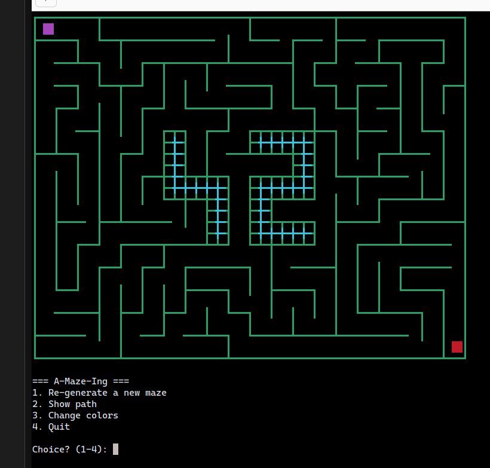
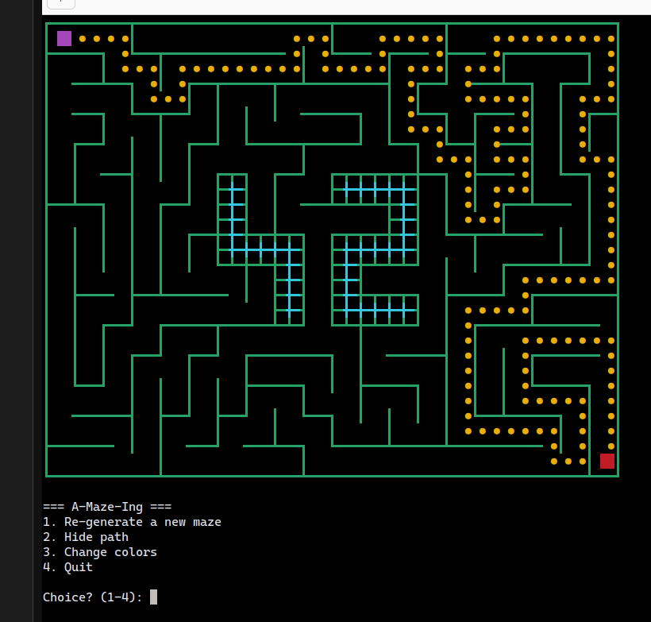
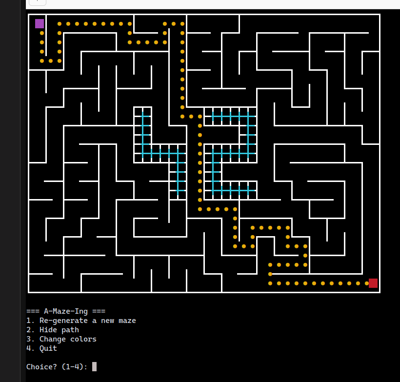
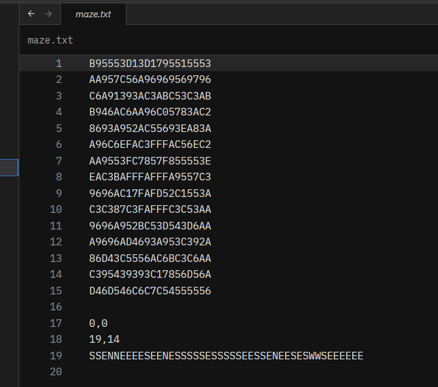

# A-Maze-Ing

*This project has been created as part of the 42 curriculum by **sefloresone** and **Pabloms63**.*

## Description

**A-Maze-Ing** is a Python library designed to generate and solve both perfect and imperfect mazes using backtracking and search algorithms. A perfect maze is defined as one containing exactly one unique path between the entry and exit.

This project demonstrates a modular architecture of:
- Maze Generation: with and extra feature (injection of a custom "42" pattern).
- Pathfinding: BFS (Breadth-First Search).
- Visualizer: Using ANSI and Unicode characters.
- File Handling: Exporting the results to files and parsing configuration inputs.

## Characteristics

- **Modular generator**: Creates mazes of any size with configurable entry and exit points.
- **42 logo integration**: Injects a custom "42" pattern if there is enough space.
- **BFS**: Finds the shortest path between entry and exit.
- **Interactive Menu**: Shows/Hides path, colour changing, regenerates maze
- **Export System**: Saves the maze in a *.txt* file, including the solution path.

## Installation

### Prerequisites
- Python 3.10+
- pip

> [!WARNING]
> **Important:** I **strongly** recommend using virtual environments to avoid *Makefile* errors or *permission* errors.

### Don't know how to create one? Don't worry...

Follow this steps in order to create one, it's very easy:

- 1. Open your terminal at the root of the project and write this

```bash
# 1.
python3 -m venv env
```

- 2. Activate the virtual environment

```bash
# 2.
source env/bin/activate
```

- 3. You're ready to go


### Project compilation, step-by-step

```bash
# 1. Install dependencies
make install

# Or manually install it:
python3 -m pip install -r requirements.txt
python3 -m pip install -e . --no-build-isolation
```

## Use

### Interactive mode

```bash
make run
```

### And voilà, there is your beautiful maze



**Interactive menu (Sorry it's in Spanish) :**
- `1` - Generate new maze
- `2` - Shows/hides path
- `3` - Change walls colours
- `4` - Exit

### Show path



### Change colours



### As a library

See [`test_package.py`](test/test_package.py) for an example.

## The famous config file

File `config.txt`:

```plaintext
WIDTH=50
HEIGHT=50
ENTRY=1,3
EXIT=24,14
OUTPUT_FILE=output_maze.txt
PERFECT=True
```

**Parameters:**
- `WIDTH`, `HEIGHT`: Maze dimensions
- `ENTRY`: Entry as `x,y`
- `EXIT`: Exit as `x,y`
- `PERFECT`: `True` for perfect mazes, `False` imperfect ones.
- `OUTPUT_FILE`: Output file path, only `.txt`


## Project management

### Team
- **sefloresone**: Initial development, project architecture and documentation
- **Pabloms63**: Optimization, visualizer and documentation

### Quality management

```bash
# Clean generated
make clean      # Deletes __pycache__, dist/, .mypy_cache

# Build
make build      # Distribution with setuptools
```

## Technical notes

- **Visualizer**: ANSI colors (colores) and heavy Unicode (paredes gruesas)
  - Cannot render in limited terminals or native Windows CMD

- **"42" Logo**: Requires min. 11×9 cells

- **Output format**: Coordinates + Entry/Exit tuples + path (N/S/E/W) in plain text



## Also...

### You can generate the maze using a reproducible seed
```python
gen = MazeGenerator(20, 20, (0, 0), (19, 19), seed=42)
gen.generate_maze()
```

```plaintext
WIDTH=50
HEIGHT=50
ENTRY=1,3
EXIT=24,14
OUTPUT_FILE=output_maze.txt
PERFECT=True
SEED=42
```

## Resources

- **Algorithms**:
  - [Recursive Backtracking](https://en.wikipedia.org/wiki/Maze_generation_algorithm#Recursive_backtracker)
  - [BFS Pathfinding](https://en.wikipedia.org/wiki/Breadth-first_search)

- **Internal documentation**: Docstrings in each module

## AI Usage

- Project documentation
- Refactoring